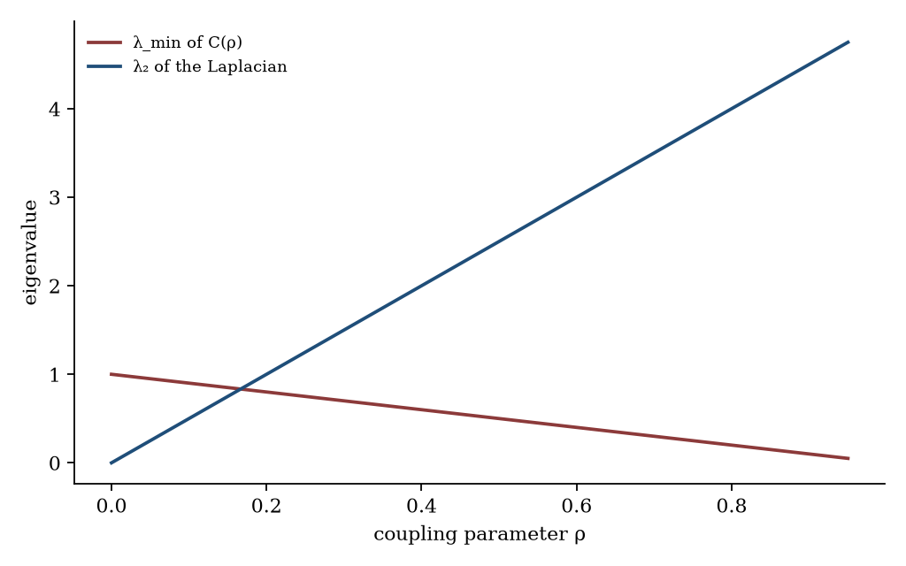
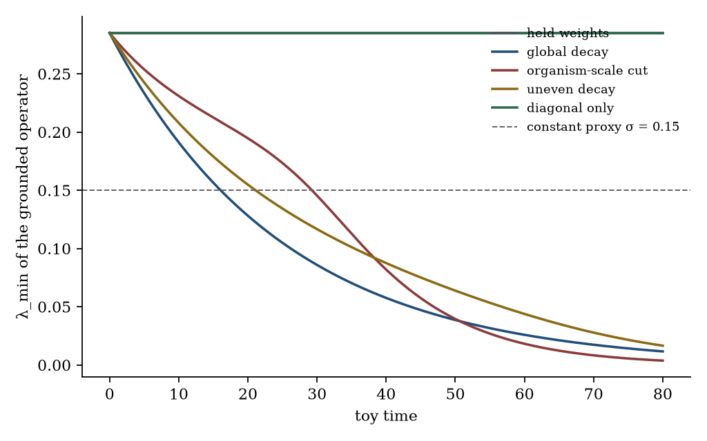
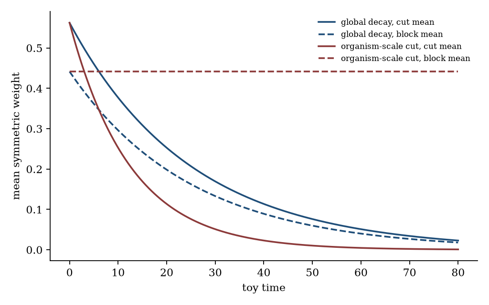
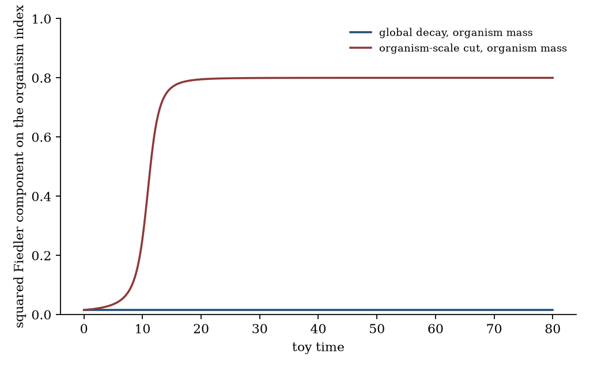
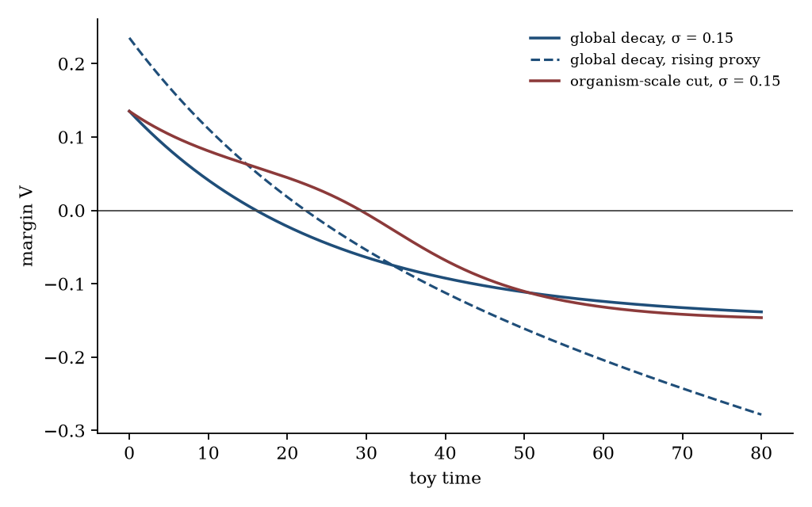

# Bounded Adaptive Coherence: a coupling-tensor λ_min criterion as a computational object for aging-versus-cancer failure modes

**Thesis #18. Computational research thesis**  
**Author:** Kelechi Emeka Ogbonna  
**Correspondence:** kelechiogbonna300@gmail.com · https://github.com/cloudynirvana/thesis-18-bounded-adaptive-coherence  
**Date:** 21 September 2026  
**Format:** B.Sc. project chapters (Nile University style), written as a computational methods manuscript  
**Status:** Definitions and propositions on a declared toy matrix, plus a seeded numerical check. Not a measurement of aging or cancer.  
**Citation style:** numbered Vancouver. A `doi:` field appears only where Crossref returned the record.  
**DOI:** none for this document. Do not invent one.

---

## Title page

**BOUNDED ADAPTIVE COHERENCE: A COUPLING-TENSOR λ_min CRITERION AS A COMPUTATIONAL OBJECT FOR AGING-VERSUS-CANCER FAILURE MODES**

BY

**KELECHI EMEKA OGBONNA**

A COMPUTATIONAL RESEARCH THESIS  
(IN-SILICO SPECTRAL CRITERION ON A TOY COUPLING MATRIX)

SUBMITTED AS A CITEABLE MANUSCRIPT FOR JOURNAL / THESIS HANDOFF

PROJECT CONFLUENCE  
INDEPENDENT COMPUTATIONAL RESEARCH

SUPERVISOR: not appointed for this deposit

SEPTEMBER 2026

---

## Declaration

I, Kelechi Emeka Ogbonna, declare that this computational research thesis was carried out by me. The eigenvalues, sector means, classes, and crossing times reported here were produced by `sim/bac_toy.py` at seed 20260921. They are not wet-lab measurements and not patient outcomes. No DOI, ORCID, or journal acceptance was invented for this document.

_________________________     _______________________  
Kelechi Emeka Ogbonna         Date

---

## Abstract

Can the Principle of Bounded Adaptive Coherence — λ_min(C(t)) against scale-wise entropy production — be stated as a falsifiable computational object such that aging-like global coupling decay and cancer-like selective organism-scale decoupling appear as distinct sectors of the same tensor, without claiming clinical rejuvenation or cure?

The literal reading, a minimum eigenvalue of the raw coupling matrix, is not that object. On the family C(ρ) = (1−ρ)I + ρ 11T, λ_min falls from 1 to 0.05 as ρ goes from 0 to 0.95, while the algebraic connectivity of the associated Laplacian rises from 0 to 4.75. A directed 3-cycle with entries in {0,1} has a non-real conjugate pair, so "the smallest eigenvalue" is not a real scalar. The initial skewed toy matrix is real-spectral and already has λ_min = −0.058860, which would fail a comparison with the proxy 0.15 before any weight has moved.

The criterion used here is the minimum eigenvalue of the grounded Laplacian Γ built from the symmetric off-diagonal weights, minus a declared dimensionless proxy σ. Five closed-form paths are run on one 5×5 weight matrix. Global decay is classed aging-like: every Laplacian eigenvalue scales by e−0.04t, and the sector ratio does not move. Decay confined to the four edges that touch the organism index is classed cancer-like: block algebraic connectivity stays at 0.990917, and the squared Fiedler mass on that index rises from 0.015496 to 0.800000. Against σ = 0.15 the global path crosses zero margin at toy time 16.055 and the cut path at 29.259. The earlier crossing is not a severity ranking. An uneven decay, a diagonal-only decay, and a held matrix are classed neither. A rising proxy crosses the held matrix at 78.367. No entropy production was computed. The names "aging-like" and "cancer-like" are classifier labels on this toy.

Research only. Not a medical device, not a rejuvenation method, and not a cure.

---

## Keywords

coupling matrix; grounded Laplacian; algebraic connectivity; bounded adaptive coherence; sector classifier; toy model; spectral graph theory; entropy-production proxy; research only

---

## Table of Contents

DECLARATION  
ABSTRACT  
Table of Contents  
List of tables and figures  

CHAPTER ONE. INTRODUCTION  
1.1 Background to the study  
1.2 STATEMENT OF RESEARCH PROBLEM  
1.3 JUSTIFICATION OF STUDY  
1.4 AIM AND OBJECTIVES OF THE STUDY  
1.5 SIGNIFICANCE OF THE STUDY  
1.6 SCOPE OF THE STUDY  

CHAPTER TWO. LITERATURE REVIEW  
2.1 Network ageing is not yet a coupling tensor  
2.2 Cancer, clonal evolution, and the word "decoupling"  
2.3 A weakest-link eigenvalue  
2.4 Entropy production is not a free scalar  
2.5 A neighbouring question about hazard shape  

CHAPTER THREE. MATERIALS AND METHODS  
3.1 Design, and a rule against repairing the object  
3.2 The coupling matrix and its symmetric weights  
3.3 Laplacian, grounded operator, and the margin  
3.4 Propositions about the toy matrices  
3.5 Five weight paths and two proxies  
3.6 Pattern definitions  
3.7 What was not done  

CHAPTER FOUR. RESULTS  
4.1 The raw eigenvalue moves against the prose  
4.2 A held matrix can still cross  
4.3 Global decay is one sector  
4.4 An organism-scale cut is another sector  
4.5 A negative margin is not a sector label  
4.6 Checks  

CHAPTER FIVE. DISCUSSION, CONCLUSION AND RECOMMENDATION  
5.1 Discussion  
5.2 Conclusion  
5.3 Recommendation  

REFERENCES  
DISCLAIMER  

---

## List of tables and figures

**Table 3-1.** Initial symmetric weights.  
**Table 3-2.** Edge rates by path.  
**Table 3-3.** Classifier thresholds.  
**Table 4-1.** Classes and constant-proxy crossing times.  
**Table 4-2.** Grounded λ_min along four paths.  
**Table 4-3.** Sector means and block algebraic connectivity.

**Figure 4-1.** λ_min(C(ρ)) against algebraic connectivity.  
**Figure 4-2.** Grounded λ_min on the five paths.  
**Figure 4-3.** Cut mean and block mean.  
**Figure 4-4.** Squared Fiedler mass on the organism index.  
**Figure 4-5.** Margin against the two proxies.

Figures are diagnostics from `sim/bac_toy.py`. They are not measured networks.

---

# CHAPTER ONE

## 1.0 INTRODUCTION

### 1.1 Background to the study

Aging and cancer are often placed in one review because both are failures of maintenance, and because the two hallmark lists can be printed side by side [1–3]. The cancer list is the older of the two in its first form. It has been revised [4–6]. None of those lists is a matrix, and none of them states an eigenvalue.

Network accounts of aging already exist, and they are more specific than a hallmark heading. Kirkwood's argument is that aging is not a single programme waiting to be switched off [7]. Kowald and Kirkwood wrote an explicit network of damage, error, and scavenging [8]. More recent work treats deficit count, frailty, and mortality as properties of a dynamical network rather than as a private clock in one cell type [9–12]. Gompertz's 1825 curve is the demographic shape some of those models are asked to resemble [13]. A separate computational deposit asks when load×gain coupling of damaged subsystems produces a Gompertz-like hazard, and which of the assumptions would be identifiable from a public life table [14]. That question is about the shape of a simulated failure-time distribution. It is not asked again here, and no number in Chapter Four is taken from that deposit.

Cancer, in the evolutionary literature, is clonal selection inside a soma that did not build the clone for that purpose [15,16]. Cellular senescence is discussed on both the aging side and the cancer side. That double appearance does not make senescence an entry of a coupling matrix [17]. Systems biology has its own words for robustness, and for the claim that no single level of organisation owns causation [18,19]. Spectral graph theory has a quantity that actually means "weakest coordination": the algebraic connectivity of a Laplacian [20]. This thesis uses that quantity on a toy. It does not estimate a biological network.

A preparatory wording of a principle of bounded adaptive coherence asked for something sharper than a hallmark list. The minimum eigenvalue of a cross-scale coupling tensor was to dominate scale-wise entropy production, and aging-like global decay and cancer-like loss of organism-scale coupling were to appear as different sectors of that same tensor. A scalar ratio cannot see a sector. An eigenvalue might, once the matrix it belongs to has been named. May's warning applies before any of the biology is invoked: an equation borrowed from a neighbouring field still has to be the equation the prose describes [21]. Saltelli and colleagues make the same demand of any model that might be mistaken for a decision [22].

### 1.2 STATEMENT OF RESEARCH PROBLEM

Can the Principle of Bounded Adaptive Coherence — λ_min(C(t)) against scale-wise entropy production — be stated as a falsifiable computational object such that aging-like global coupling decay and cancer-like selective organism-scale decoupling appear as distinct sectors of the same tensor, without claiming clinical rejuvenation or cure?

The working form is narrow. There are five indices. There is one nonnegative matrix. There are two candidate spectral summaries, the minimum eigenvalue of the raw matrix and the minimum eigenvalue of a grounded Laplacian built from its symmetric weights. There is one declared proxy in place of an entropy-production rate. There are five weight paths and a classifier whose thresholds are fixed in the script. The question is whether those paths separate, on this toy, into the two named sectors, and whether the literal eigenvalue is the separator.

Collapse, if it happens, is a property of this matrix and this classifier. It is not a statement about every model of aging or cancer [21]. A familiar way to miss the question is to treat a negative margin as a diagnosis. The classifier can return "neither" on a path whose margin has already changed sign. That return is part of the object.

### 1.3 JUSTIFICATION OF STUDY

The literal formula is short enough to repeat, and on a standard one-parameter family of coupling matrices it points the wrong way. Chapter Four records the family. Cross-scale language in the aging and cancer reviews is also short enough to repeat, and it does not by itself name a matrix element [3,9,19]. The study is justified as a separation of three sentences that are easy to run together: a definition of a spectral margin, a proposition about sectors of a toy weight matrix, and a biological claim. Only the first two are attempted. The third is refused [21,22].

The neighbouring hazard deposit, whatever numerical state it is in, remains a question about Gompertz-like shape under load and gain [13,14]. A result about λ_min does not supply a mortality curve. A mortality curve would not supply this margin.

The study is not justified as a device, a rejuvenation protocol, or a claim that any index name is a treated cohort [22].

### 1.4 AIM AND OBJECTIVES OF THE STUDY

The aim is to state the bounded-adaptive-coherence comparison as a falsifiable computational object on the toy in Chapter Three, and to test whether global off-diagonal decay and selective decay of the organism-index edges fall in distinct classes under the predeclared rule.

The objectives are:

1. Test the literal minimum eigenvalue of a raw coupling matrix against the prose that a stronger coupling should raise the criterion.
2. Define the symmetric weight, the Laplacian, the grounded operator, the induced block, and the margin.
3. Prove scaling, monotonicity, diagonal blindness, and a cut bound, and check them numerically.
4. Run five closed-form weight paths and apply the classifier without editing its thresholds.
5. Keep clinical rejuvenation, cure, and any reading of a positive margin as organismal viability outside the aim.

Non-aims. Estimating the matrix from a multi-omic time series. Mapping an epigenetic clock onto a diagonal entry. Ranking drugs. Producing a Gompertz hazard [13,14]. Interpreting a row label as a tissue.

### 1.5 SIGNIFICANCE OF THE STUDY

The useful product is a criterion that can fail in public. If the cut path and the global path receive the same class, the sector claim fails on this toy. If the raw minimum eigenvalue rose with the coupling parameter ρ, the rejection of the literal formula would fail. Those checks can be rerun without accepting a clinical sentence [21,22].

There is a second product inside the same script. The margin can change sign on a path the classifier refuses to name. That split is what stops a negative number from being promoted into one of the two biological words.

What the significance is not: a rejuvenation mechanism, a reason to delete a row of a patient-derived matrix, or a replacement for the hallmark reviews [1–6].

### 1.6 SCOPE OF THE STUDY

In scope. The linear algebra of a 5×5 nonnegative matrix. Closed-form exponential weights. One constant proxy and one affine proxy. The classifier thresholds in Section 3.6. Two hundred monotonicity draws at seed 20260921.

Out of scope. Measured entropy production. Human or animal data. Drug inputs, reprogramming factors, and senescent-cell clearance. Spaceflight schedules. Any identification of the five index names with assays. A stochastic process, a likelihood, and a regulatory use.

---

# CHAPTER TWO

## 2.0 LITERATURE REVIEW

### 2.1 Network ageing is not yet a coupling tensor

The 2013 hallmark review organised aging as a short list of processes, from genomic instability to altered intercellular communication [1]. The 2023 revision lengthened the list and kept the same genre: a narrative taxonomy, not a spectrum [2]. A companion review sets those processes next to cancer hallmarks and calls the overlap a meta-hallmark structure [3]. The overlap is a reason to be careful. It is not a tensor.

Kirkwood's review is useful here because of what it refuses. Aging, on that account, is the late consequence of limited maintenance, not a programme one would reverse by naming a target [7]. Kowald and Kirkwood had already put a related idea into a network of mitochondria, aberrant protein, radicals, and scavengers [8]. The network is a biochemical cartoon with rates. It is not a matrix of couplings among organisational scales, and it does not contain an eigenvalue condition.

Cohen and colleagues argue for a complex-systems reading of aging biology, in which heterogeneity and network structure are part of the phenomenon rather than noise around a single marker [9]. Mitnitski, Rutenberg, Farrell, and Rockwood treat frailty as a feature of a complex network of health deficits [10]. Taneja, Mitnitski, Rockwood, and Rutenberg give a dynamical network whose outputs include mortality [11]. Rutenberg, Mitnitski, Farrell, and Rockwood press the same construction as a way to hold aging and frailty in one model [12]. Those papers are the closest external literature to a coupling story. Their object is deficit accumulation and, in some of them, a hazard. The object in Chapter Three is a margin of a Laplacian. The two can be discussed in one paragraph. They are not the same calculation, which is why the Gompertz deposit is left as a citation rather than a source of curves [13,14].

Inflammaging is one proposed late-life pattern in which immune and metabolic change travel together [23]. Geroscience is the broader claim that aging biology and chronic disease share mechanisms [24]. Both are reasons one might want a cross-scale object. Neither paper defines the matrix C(t) used below, and this thesis does not fit either literature's data.

### 2.2 Cancer, clonal evolution, and the word "decoupling"

Nowell described tumour progression as clonal evolution under selection [15]. Greaves and Maley restated the point with the genetic tools of a later decade: a tumour is a population process, not a single transformed cell written once [16]. The hallmark reviews catalogue the phenotypes that keep turning up in that process [4–6]. Campisi's review places cellular senescence on the boundary between the two diseases: an arrest that can suppress a clone and, later, a secretory phenotype that can promote one [17]. None of these papers measures an edge weight between an "organism index" and a "cellular index".

Huang, Ernberg, and Kauffman describe cancer as occupation of an attractor of a gene-regulatory dynamics [25]. That is a systems sentence about a state inside one network. It is not a cut in a Laplacian, and Chapter Four does not identify either toy class with an attractor. Kitano's account of biological robustness is the general warning that a function can survive large internal damage until a specific coupling fails [18]. The warning motivates a weakest-link number. It does not choose the number.

The preparatory wording called malignant behaviour a local viability that survives after organism-scale couplings have collapsed. The sentence can be made precise only after the cut is declared. Section 3.1 declares it as the four undirected edges that touch one index. That declaration is a modelling choice on a toy. It is not a demonstration that tumours are that index [15,16,21].

### 2.3 A weakest-link eigenvalue

Fiedler defined the algebraic connectivity of a graph as the second-smallest eigenvalue of its Laplacian, and showed that it is positive exactly when the graph is connected [20]. Merris surveys the Laplacian and the quadratic form that makes monotonicity in the edge weights easy to see [26]. Newman reviews the wider use of networks in which a spectrum is a summary of connectivity rather than a decoration [27]. Barabási, Gulbahce, and Loscalzo argue that some diseases are usefully read as perturbations of a biological network [28]. The argument is an invitation to name the network. This thesis names a five-index toy and stops there. It does not build an interactome, and it does not import a disease module.

The quadratic form also explains a mistake that is easy to make with the symbol λ_min. For a Laplacian, the smallest eigenvalue is zero whenever the graph has at least one node. The informative end of the spectrum is the next eigenvalue, or the smallest eigenvalue of a grounded principal submatrix, which deletes one reference index and can be positive definite while the graph is connected [20,26]. The minimum eigenvalue of a dense nonnegative matrix is a different functional. Section 3.4 writes a family on which the two functionals move in opposite directions as every off-diagonal entry is raised together.

Noble's biological relativity is the claim that no level of description has a permanent causal privilege [19]. The claim is why this thesis stores a directed matrix at all. It is also why the loss of that direction must be confessed: the Laplacian is built from the symmetric part. A directed surplus can sit in C and never enter Γ. Chapter Four records one such surplus. The confession is a limitation of the criterion, not evidence that causation in organisms is symmetric [19].

### 2.4 Entropy production is not a free scalar

Seifert's review places entropy production inside stochastic thermodynamics: a specified Markov process, a set of fluxes, and a sign convention [29]. A difference "λ_min minus the fastest entropy production" is meaningful only after both terms have been given a common dimensionless scale by a declared map. This repository contains no Markov process at the five indices, so it contains no entropy production. The symbol σ in Chapter Three is a proxy schedule. Calling it entropy production would be a change of name, not a derivation [21,29].

Two empirical aging indices are worth naming so they are not quietly reused. Horvath's methylation clock is a weighted sum of CpG sites trained against chronological age [30]. Ferrucci and colleagues review the wider attempt to measure biological aging in humans and treat it as an open measurement problem [31]. Neither instrument is a diagonal entry of C. Schreiber's transfer entropy is a candidate estimator for a directed coupling from a pair of time series [32]. It is not computed in this deposit. A future measurement paper would have to begin by saying which series, at which scales, enter which entry. This paper ends before that sentence.

### 2.5 A neighbouring question about hazard shape

Gompertz wrote a hazard that rises exponentially with age [13]. The network models in Section 2.1 can be asked why a hazard should bend that way when a local damage variable looks closer to linear [10–12]. Thesis #13 isolates that question as load×gain coupling and as an identifiability problem against demographic schedules [14]. The margin V(t) defined below is not a hazard. A path can cross V = 0 without a survival function being defined on the same time axis. This thesis reports crossing times of a toy margin and does not convert them into lifespans, incidence rates, or a comparison of human aging with human cancer.

---

# CHAPTER THREE

## 3.0 MATERIALS AND METHODS

### 3.1 Design, and a rule against repairing the object

The generator is fixed. Seed 20260921 governs two hundred random edge lifts used to check monotonicity. The five weight paths are deterministic. Software is `sim/bac_toy.py`. Eigenpairs use the symmetric QR routine in NumPy. No differential equation is integrated: every weight that moves has the closed form in Section 3.5, and the spectrum is recomputed on a uniform grid.

The index set has five elements, in this order: molecular, cellular, tissue, organism, evolutionary. These words are row names. They are not assays, not hallmarks, and not permission to read a result as a statement about those biological scales [1,4,21]. The organism index is row 3. The ground index, the row deleted to form Γ, is row 4 (evolutionary). The cut is the set of undirected edges with one end at row 3. The block is the other six undirected edges. All four of these choices are written in the script before any class label is computed.

One revision rule is imposed on the author of the script, and on a later edit. The index set, the ground, the cut, the proxy schedules, and the classifier thresholds may not be changed in order to turn a negative margin back into a positive one, or to force a path into a named class. A path that the rule calls "neither" stays "neither". The rule is a constraint on model revision. It is not a biological axiom, it is not a premise of the propositions in Section 3.4, and it is not a clinical instruction. It is recorded because a criterion that can be resized after the curves are seen is not falsifiable in the narrow sense this thesis claims [22].

### 3.2 The coupling matrix and its symmetric weights

Let C(t) be a real 5×5 matrix. The off-diagonal entry Cij(t) is a directed coupling weight from index j to index i. The construction below forces those weights to stay inside (0,1) on the paths that are actually run. The diagonal Cii(t) is stored as a within-index weight. Proposition 4 says the spectral criterion does not see it. The diagonal is carried anyway, so that blindness can be shown rather than assumed.

The symmetric weight used by every Laplacian is

Wij = (Cij + Cji) / 2 &nbsp; for i ≠ j, &nbsp; and &nbsp; Wii = 0.

Table 3-1 gives the initial W. It is connected. The initial diagonal of C is 0.90 at every index. A fixed skew is then added, and left constant in time: +0.04 on the cellular-to-organism entry and −0.04 on the return; −0.03 on the tissue-to-organism entry and +0.03 on the return; +0.02 on the molecular-to-cellular entry and −0.02 on the return. The resulting C(0) is the matrix stored as `C0_asymmetric` in `sim/results.json`. Its symmetric part recovers Table 3-1.

**Table 3-1.** Initial symmetric off-diagonal weights. Cut edges touch the organism index.

| Pair | W(0) | Sector |
| --- | ---: | --- |
| molecular–cellular | 0.80 | block |
| molecular–tissue | 0.35 | block |
| molecular–organism | 0.55 | cut |
| molecular–evolutionary | 0.20 | block |
| cellular–tissue | 0.75 | block |
| cellular–organism | 0.60 | cut |
| cellular–evolutionary | 0.25 | block |
| tissue–organism | 0.70 | cut |
| tissue–evolutionary | 0.30 | block |
| organism–evolutionary | 0.40 | cut |

The cut mean at t = 0 is (0.55+0.60+0.70+0.40)/4 = 0.5625. The block mean is (0.80+0.35+0.20+0.75+0.25+0.30)/6 = 0.441667. The cut sum, used in the bounds, is 2.25.

### 3.3 Laplacian, grounded operator, and the margin

The combinatorial Laplacian of W is

Lii = Σj≠i Wij, &nbsp; Lij = −Wij for i ≠ j.

Its eigenvalues are real and nonnegative. The smallest is 0, with eigenvector constant on a connected component. The algebraic connectivity λ2(L) is the second-smallest eigenvalue [20].

The grounded operator Γ is the principal submatrix of L obtained by deleting the evolutionary row and column. It is symmetric and positive semidefinite, because it is the quadratic form of L restricted to vectors that vanish at the ground. Its smallest eigenvalue is written λ_min(Γ). This is the λ_min in the criterion below. It is not λ_min(C), and it is not λ2(L). At the initial weight those three numbers are different; Chapter Four lists them.

The induced block Laplacian Lblock is the Laplacian of the subgraph on the four indices other than the organism index. Edges that touch the organism index do not appear in it. Its algebraic connectivity is written λ2(Lblock).

The proxy σ(t) is dimensionless by declaration. Two schedules are used:

σhold(t) = 0.15,

σrise(t) = 0.05 + 0.003 t.

The margin on a chosen schedule is

V(t) = λ_min(Γ(t)) − σ(t).

V is not a Lyapunov function of a biological state. No state equation is being stabilised. The sign of V is a comparison between one eigenvalue and one declared schedule [21,29]. The primary comparison in the tables is against σ_hold. The rising schedule is there to show that the sign can change when the matrix does not.

### 3.4 Propositions about the toy matrices

The following statements are propositions about real matrices of the kinds just defined. They are not theorems about organisms, aging, or cancer. Proofs are elementary and are given in full so that a failed numerical check would indicate a bug rather than a deep objection.

**Proposition 1 (Rayleigh form).** For any real x,

xT L x = Σi&lt;j Wij (xi − xj)2.

In particular λ2(L) = min { xT L x : ‖x‖ = 1, 1T x = 0 }.

The identity is the standard expansion of the Laplacian quadratic form [26]. The characterisation of λ2 is the variational definition on the complement of the constants [20].

**Proposition 2 (Monotonicity).** If W′ij ≥ Wij for every i ≠ j, then λ2(L′) ≥ λ2(L) and λ_min(Γ′) ≥ λ_min(Γ).

For every x, the difference of quadratic forms is Σi&lt;j (W′ij − Wij) (xi − xj)2 ≥ 0. The minimum of a larger function on the same set is larger, which gives the claim for λ2. The grounded form is the same quadratic form restricted to vectors that vanish at the ground, so the same comparison holds for λ_min(Γ).

**Proposition 3 (Uniform scaling).** If W(t) = e−δt W(0) for δ real, then every eigenvalue of L(t), of Γ(t), and of Lblock(t) equals e−δt times the corresponding eigenvalue at t = 0. Eigenvectors of L are unchanged.

Each of those three matrices is linear in the weights, and every weight that enters them carries the same factor.

**Proposition 4 (Diagonal blindness).** L, Γ, and Lblock are invariant under every change of the diagonal of C.

The diagonal is discarded when W is formed. The three operators are functions of W.

**Proposition 5 (Cut bound for λ2).** Let A be the organism index alone and B the other four indices. Let Cut = Σj≠organism Worganism, j. Then

λ2(L) ≤ (5/4) Cut.

Take the test vector with value 1 on A and value −1/4 on B. Its components sum to 0. Its squared norm is 1 + 4·(1/16) = 5/4. The quadratic form receives a contribution only from cut edges, and each such edge contributes Wij (1 + 1/4)2 = Wij · (5/4)2. Summing and dividing by the squared norm produces (5/4) Cut. The minimum λ2 cannot exceed the Rayleigh quotient of this vector.

**Proposition 6 (Cut bound for the grounded eigenvalue).** With the ground equal to the evolutionary index, which is not the organism index,

λ_min(Γ) ≤ Cut.

The vector that equals 1 at the organism index and equals 0 at the other three non-ground indices has unit norm and vanishes at the ground. Its quadratic form equals the organism degree, which is Cut. The minimum eigenvalue cannot exceed that value.

**Proposition 7 (The block does not see the cut).** If a trajectory changes only edges that touch the organism index, then Lblock is constant, and so is λ2(Lblock).

By construction, Lblock is assembled from edges with both ends outside the organism index.

**Proposition 8 (The raw minimum moves the wrong way).** For ρ ∈ [0, 1) and the 5×5 family

C(ρ) = (1−ρ) I + ρ 11T,

the eigenvalues are 1 + 4ρ, once, and 1−ρ, four times. Thus λ_min(C(ρ)) = 1−ρ, which is strictly decreasing in ρ. The off-diagonal weights equal ρ. The Laplacian of that complete graph has λ2 = 5ρ, which is strictly increasing in ρ.

On the all-ones vector, 11T contributes a factor 5, so the eigenvalue is 1−ρ + 5ρ = 1+4ρ. On the orthogonal complement, 11T x = 0, so C(ρ)x = (1−ρ)x. The smaller value on [0, 1) is 1−ρ. For the Laplacian, L = 5ρ I − ρ 11T, which gives 0 on the all-ones vector and 5ρ on the complement. Raising ρ strengthens every coupling and lowers the raw minimum eigenvalue. That is the opposite of a coordination criterion.

**Proposition 9 (A smallest eigenvalue need not be real).** Let R be the adjacency matrix of a directed 3-cycle,

R = [[0, 1, 0], [0, 0, 1], [1, 0, 0]].

The eigenvalues are the cube roots of unity: 1 and −1/2 ± i √3 / 2. The entries lie in {0,1}. There is no real λ_min.

R3 = I and R ≠ I, so the minimal polynomial divides z3−1 and does not have only real roots.

### 3.5 Five weight paths and two proxies

Each off-diagonal weight follows

Wij(t) = Wij(0) exp(−δij t),

with δji = δij and t from 0 to 80 on 801 uniform nodes, so the step is 0.1. Table 3-2 gives the rates. A zero rate is a held edge, not a fitted maintenance function. There is no state-dependent repair term. Adding one would be a different model.

**Table 3-2.** Exponential rates on off-diagonal weights.

| Path | Cut edges | Block edges | Diagonal of C |
| --- | --- | --- | --- |
| Held | 0 | 0 | held at 0.90 |
| Global decay | 0.04 | 0.04 | 0.90 exp(−0.05 t) |
| Organism-scale cut | 0.08 | 0 | cellular entry held at 0.95; other diagonal entries held at 0.90 |
| Uneven decay | 0.06 | 0.02 | held at 0.90 |
| Diagonal only | 0 | 0 | 0.90 exp(−0.05 t) |

The cellular diagonal on the cut path is set to 0.95 and held. Proposition 4 says this painting does not move λ_min(Γ). The path includes it so the claim can be checked against the unpainted initial matrix.

A crossing time against a proxy is the linear interpolate of the first grid interval on which V changes from positive to nonpositive. If V stays positive on the whole grid, the crossing is recorded as absent. For the global-decay path and the constant proxy, Proposition 3 supplies a closed form,

t* = (1/0.04) log( λ_min(Γ(0)) / 0.15 ),

which the interpolate is required to match.

### 3.6 Pattern definitions

Write r_λ = λ_min(Γ(80)) / λ_min(Γ(0)), r_block = (block mean at 80) / (block mean at 0), r_cut = (cut mean at 80) / (cut mean at 0), and s = (block/cut mean at 80) / (block/cut mean at 0).

**Table 3-3.** Thresholds, fixed in the script before the labels are read.

| Quantity | Aging-like requires | Cancer-like requires |
| --- | --- | --- |
| r_λ | &lt; 0.5 | &lt; 0.5 |
| r_block | &lt; 0.5 | &gt; 0.9 |
| r_cut | &lt; 0.5 | &lt; 0.25 |
| s | inside (2/3, 1.5) | &gt; 3 |

A path is classed aging-like when it meets the whole aging column, and cancer-like when it meets the whole cancer column. Otherwise it is classed neither. The script aborts if any path meets both columns. The words "aging-like" and "cancer-like" mean membership in these columns. They do not mean that a human disease has been simulated [1,4,22].

The global-decay path was built so that s = 1 and both means fall by the same factor e−3.2. The cut path was built so that the block mean does not fall and the cut mean falls by e−6.4. The uneven path was built so that both means fall and s moves by more than 1.5. The diagonal-only and held paths were built so that the off-diagonal weights do not move. Agreement between these intentions and the class labels is a consistency check of the script. It is not evidence that aging has this definition. The propositions, not the class names, are the part a counterexample could break.

### 3.7 What was not done

Entropy production was not computed [29]. Transfer entropy was not computed [32]. No clock, frailty index, or life table enters the script [12,30,31]. No drug, reprogramming factor, or senescent-cell rule is a term in W(t). The margin was not shown to be a Lyapunov function. A Gompertz curve was not fitted [13,14]. Noise was not added, so nothing is claimed about practical identifiability. A sixth index was not introduced.

---

# CHAPTER FOUR

## 4.0 RESULTS

### 4.1 The raw eigenvalue moves against the prose

Proposition 8 is realised numerically with maximum absolute error 0 against the closed form, on twenty values of ρ from 0 to 0.95. At ρ = 0 the raw minimum eigenvalue is 1 and the algebraic connectivity is 0. At ρ = 0.95 the raw minimum is 0.05 and the algebraic connectivity is 4.75. Strengthening every entry lowers λ_min(C) and raises λ2. Figure 4-1 plots the two curves. A coordination criterion that rose with coupling would follow the Laplacian, not the raw minimum.

**Figure 4-1.** C(ρ) = (1−ρ)I + ρ 11T. The raw minimum falls. Algebraic connectivity rises. The prose that asked λ_min to represent coordination described the second curve and wrote the symbol of the first.

Proposition 9 is realised on the directed 3-cycle. The computed eigenvalues are 1 and −0.5 ± 0.866025 i, the cube roots of unity. A real ordering "λ_min" is not defined for that matrix without an extra convention, and the convention would be doing the scientific work.

The toy's own initial matrix, skew included, happens to have a real spectrum. The eigenvalues are 2.946653, −0.058860, 0.809403, 0.543866, and 0.258938. The smallest is negative. A literal comparison of λ_min(C(0)) with σ = 0.15 would call the initial state a violation, by about 0.21, before any weight decays. The grounded eigenvalue of the same matrix is 0.285102, which sits above 0.15. The absolute gap between λ_min(Γ) computed from the skewed C(0) and λ_min(Γ) computed from Table 3-1 is 0. The skew changes the raw spectrum and does not change the operator the rest of this chapter uses.

### 4.2 A held matrix can still cross

At t = 0, before any path diverges,

λ_min(Γ) = 0.285102, &nbsp; λ2(L) = 1.413084, &nbsp; λ2(Lblock) = 0.990917.

The ratio of algebraic connectivity to the grounded eigenvalue is 4.956. Swapping the two spectral objects inside V would move every constant-proxy crossing, because the same σ would be subtracted from a number almost five times larger. The sector classifier does not use the crossing time. The crossing times below belong only to λ_min(Γ) and the named proxy.

The squared Fiedler component on the organism index starts at 0.015496. The participation ratio, (Σ vi2)2 / Σ vi4, starts at 1.592333. The initial Fiedler vector is not the cut-test vector of Proposition 5.

On the held path every weight is constant, so every eigenvalue is constant. The class is neither. Against σ_hold the margin is

V = 0.285102 − 0.15 = 0.135102

at every grid node, and there is no crossing. Against the rising proxy the same constant eigenvalue crosses zero at toy time 78.367. A failing margin does not require a decaying tensor. It can be produced by the proxy alone. Figure 4-5 shows that crossing as the held curve is absent from the eigenvalue plot and present, for the global path, as a second margin.

### 4.3 Global decay is one sector

On the global path every off-diagonal weight carries δ = 0.04, so Proposition 3 applies. The maximum absolute error between λ_min(Γ(t)) and 0.285102 e−0.04t, on the 801-node grid, is 0. The same error is 0 for λ2 and for λ2(Lblock). At t = 80 the common ratio is e−3.2 = 0.040762. The cut mean and the block mean fall by that same factor. The sector-change statistic s equals 1, which lies inside (2/3, 1.5). The class is aging-like.

Eigenvectors are invariant under the common scale, so the organism Fiedler mass stays at 0.015496 and the participation ratio stays at 1.592333. Global decay lowers the margin without rearranging the Fiedler vector. Figure 4-4 is flat on this path.

The diagonal of C falls from 0.90 to 0.016484. It is not the cause of the spectral decay. On the diagonal-only path the same diagonal schedule runs, the off-diagonal weights are held, and the range of λ_min(Γ) on the grid is 0 (Proposition 4). The class of that path is neither, and σ_hold never crosses it.

The constant-proxy crossing on the global path is 16.055 by interpolation. The closed form in Section 3.5 evaluates to 16.055304. The absolute difference is 4.9×10−5, inside one grid step of 0.1. The rising-proxy crossing on the same path is 22.293. Both numbers are toy times. Neither is an age.

**Table 4-2.** λ_min(Γ(t)), four decimals from `sim/results.json`.

| t | Global decay | Organism-scale cut | Uneven decay | Held |
| ---: | ---: | ---: | ---: | ---: |
| 0 | 0.2851 | 0.2851 | 0.2851 | 0.2851 |
| 20 | 0.1281 | 0.1946 | 0.1548 | 0.2851 |
| 40 | 0.0576 | 0.0819 | 0.0875 | 0.2851 |
| 60 | 0.0259 | 0.0182 | 0.0438 | 0.2851 |
| 80 | 0.0116 | 0.0037 | 0.0165 | 0.2851 |

At t = 20 and t = 40 the global-decay eigenvalue is the smaller of the two named paths. At t = 60 and t = 80 the cut eigenvalue is the smaller. The curves cross. A ranking of the paths by "which λ_min is lower" depends on the time at which one looks.

**Figure 4-2.** λ_min(Γ) against toy time. The dashed line is σ_hold = 0.15. Diagonal-only decay lies on top of the held path. The uneven path lies between the two named decays and is classed with neither.

### 4.4 An organism-scale cut is another sector

On the cut path the block edges are held and the cut edges carry δ = 0.08. Proposition 7 says λ2(Lblock) does not move. Its range on the grid is 0, and the value is 0.990917 at every stored node, including t = 80. The block mean stays at 0.441667. The cut mean is multiplied by e−6.4 = 0.001662. The sector-change statistic is 601.845. Every cancer-like threshold in Table 3-3 holds, and no aging-like threshold on s or on the block mean does. The class is cancer-like.

The squared Fiedler mass on the organism index rises from 0.015496 to 0.800000. The value 0.800000 is 4/5, the squared mass of the normalised test vector in Proposition 5. The participation ratio falls from 1.592333 to 1.538462, and 1.538462 is the six-decimal rounding of 20/13, the participation ratio of that same test vector. The late vector is the balanced cut vector, with one index against the other four. It is not a spike on a single coordinate. Figure 4-4 shows the mass moving early and then sitting on 0.8, while the global path does not move.

Proposition 5 bounds λ2 by (5/4) Cut. The smallest slack of that bound on the cut-path grid is 0 at the six decimals stored in `sim/results.json`, which means the slack is below 5×10−7. The bound is met, at that rounding, once the Fiedler vector has reached the test vector. It is not an identity at t = 0, where the slack is 1.399416. Proposition 6 bounds λ_min(Γ) by Cut. The smallest slack of that bound on the same grid is 1.3×10−5.

The constant-proxy crossing is 29.259, later than the global path's 16.055. Under these rates and this σ, selective removal of the organism-index edges does not produce the earlier failure. The block edges that remain hold λ_min(Γ) up through the first part of the grid (Table 4-2). The class distinction is the sector pair, not the order of the crossings.

The cellular diagonal is 0.95 throughout the cut path. The grounded eigenvalue at t = 0 agrees with the unpainted matrix. The agreement is exact in the stored check (gap 0), as Proposition 4 requires. Painting a within-index weight does not restore, and does not damage, this margin.

**Figure 4-3.** Solid curves are cut means. Dashed curves are block means. Global decay moves the two means together. The cut path holds the block mean and collapses the cut mean.

**Figure 4-4.** Under global decay the mass is constant. Under the cut it approaches 4/5.

### 4.5 A negative margin is not a sector label

The uneven path decays the cut at rate 0.06 and the block at rate 0.02. At t = 80, r_λ = 0.057989, r_cut = 0.008230, r_block = 0.201897, and s = 24.533. The block has fallen too far for the cancer-like column, and s has moved too far for the aging-like column. The class is neither. The constant-proxy crossing is still present, at 21.102. Block algebraic connectivity falls from 0.990917 to 0.200063, ratio 0.201897, which is e−1.6 and matches the block rate times 80. A path can violate the margin, move both sectors, localise the Fiedler mass (0.799927 at t = 80), and still receive neither name.

The diagonal-only path was already used in Section 4.3. The held path was already used in Section 4.2. Table 4-1 collects the classes. Three of the five paths are neither. Two of those three still have a crossing, one against σ_hold (the uneven path) and one only against σ_rise (the held path, and the diagonal-only path, which shares its eigenvalues).

**Table 4-1.** Class under Table 3-3, and crossing of λ_min(Γ) through σ_hold. Absent means V stayed positive on the grid.

| Path | Class | Crossing, σ = 0.15 | Crossing, rising σ |
| --- | --- | ---: | ---: |
| Held | neither | absent | 78.367 |
| Global decay | aging-like | 16.055 | 22.293 |
| Organism-scale cut | cancer-like | 29.259 | 30.581 |
| Uneven decay | neither | 21.102 | 26.381 |
| Diagonal only | neither | absent | 78.367 |

**Table 4-3.** Sector summaries. Ratios are value at t = 80 divided by value at t = 0.

| Path | Cut-mean ratio | Block-mean ratio | λ2(Lblock) ratio | Organism mass at 80 |
| --- | ---: | ---: | ---: | ---: |
| Held | 1 | 1 | 1 | 0.015496 |
| Global decay | 0.040762 | 0.040762 | 0.040762 | 0.015496 |
| Organism-scale cut | 0.001662 | 1 | 1 | 0.800000 |
| Uneven decay | 0.008230 | 0.201897 | 0.201897 | 0.799927 |
| Diagonal only | 1 | 1 | 1 | 0.015496 |

**Figure 4-5.** V(t) for global decay under both proxies, and for the organism-scale cut under the constant proxy. The zero line is the comparison, not a biological threshold. The held path is omitted; its constant-proxy margin is the horizontal value 0.135102.

### 4.6 Checks

Two hundred single-edge lifts of +0.05, drawn at seed 20260921, produced 0 decreases of λ2 and 0 decreases of λ_min(Γ), to a tolerance of 10−10 (Proposition 2). Fifty random vectors orthogonal to the constants matched the Rayleigh form with maximum absolute error 0 (Proposition 1). Every scaling error quoted in Section 4.3 is 0 (Proposition 3). The diagonal-only range and the cut-path block range are 0 (Propositions 4 and 7). Both cut slacks stay nonnegative (Propositions 5 and 6). The ρ family matches Proposition 8 with error 0. The cycle has a non-real pair (Proposition 9). The five class labels match the five predeclared expectations, including "neither" for the uneven path. The script raises if any of these fail. This run did not raise.

---

# CHAPTER FIVE

## 5.0 DISCUSSION, CONCLUSION AND RECOMMENDATION

### 5.1 Discussion

The question in Section 1.2 has a qualified answer on this toy. The comparison can be stated as a computational object, and the two named patterns can be made to occupy different sectors of one weight matrix. The qualification is the operator. The object is V(t) = λ_min(Γ(C(t))) − σ(t), together with the classifier in Table 3-3. It is not λ_min of the raw matrix. Proposition 8 and Figure 4-1 are the reason: on the family that raises every coupling together, the raw minimum falls. Proposition 9 is the second reason: a nonnegative matrix need not have a real minimum eigenvalue at all. The initial skewed toy matrix is a third, more local reason. Its raw minimum is already −0.058860, so the literal inequality fails in the initial state that the grounded margin still calls positive.

The sector split is real inside the toy, and it is spectral rather than only a pair of averages. Global decay multiplies λ_min(Γ), λ2(L), and λ2(Lblock) by the same factor and leaves the Fiedler vector where it was. The organism-scale cut leaves λ2(Lblock) at 0.990917, drives the organism Fiedler mass to 4/5, and meets the λ2 cut bound at the stored rounding. Those are different motions of the same initial matrix. Table 4-1 is the classifier's reading of them.

The order of the crossings blocks a slogan that would otherwise be easy to attach. Under σ = 0.15 the global path crosses at 16.055 and the cut path at 29.259. Through t = 40 the global eigenvalue is the smaller one; by t = 60 the cut eigenvalue is smaller (Table 4-2). "Cancer-like" in this script is not "the earlier failure" and not "the lower curve at every time". Anyone who wants either slogan needs a different functional, declared before the curves are drawn [21,22].

Diagonal blindness blocks a second slogan from the preparatory wording: that within-index coherence sits inside the same eigenvalue as cross-index coupling. The diagonal-only path takes the diagonal from 0.90 to 0.016484 and does not move λ_min(Γ). The cut path holds a cellular diagonal at 0.95 and would have the same grounded spectrum if that entry were 0.90. Sentences that restore a named biological coupling by a named intervention are not instances of this object. They were not simulated, and the object could not see a purely diagonal restoration if they had been.

The proxy is the other free choice. The held matrix crosses the rising schedule at 78.367 with every weight fixed. The sign of V is then a comparison of two schedules the author is free to draw. That is why it is a computational object rather than a law. Falsifying it as a law about organisms would require data this repository does not contain [29–31]. Falsifying it as linear algebra would require one of the checks in Section 4.6 to fail. Those checks passed at this seed.

Asymmetry is stored and then discarded. The gap of 0 between the grounded eigenvalues of C(0) and of W(0) is the discard. If the scientific target is a difference between upward and downward causation, Γ is the wrong summary [19]. The thesis keeps the skew in the deposited matrix so that the discard stays visible. A criterion aimed at that difference would have to use a directed quantity on purpose, for example a transfer entropy on a specified pair of series [32]. Specifying the series would be a different study.

The revision rule in Section 3.1 did a small piece of work and should not be inflated. The uneven path is negative from toy time 21.102 and is classed neither. The thresholds were not widened to absorb it, and a sixth index was not added to lift V. That is ordinary predeclaration [22]. It is not a metaphysical constraint on living systems, and it was not used as a premise when the cut bound was proved.

The row names remain a temptation. Genomic instability, disabled autophagy, senescence, and altered intercellular communication are names in a review [1,2]. Clonal evolution is a population process [15,16]. Inflammaging and frailty are empirical patterns with their own measurements [10,23,24]. Writing any of those words on a row of Table 3-1 does not convert λ_min(Γ) into a measurement of them. The hazard-shaped question, in which local damage and a gain produce a Gompertz-like curve, stays in its own deposit [13,14]. Nothing proved here about a Laplacian supplies that curve.

Limitations, kept specific:

- Five indices and the initial weights are a choice. A different connected W(0) would change the initial eigenvalues. It would not reverse Proposition 8, which does not use Table 3-1.
- Exponential decay is the linear path on which Proposition 3 is exact. A state-dependent repair function is a different model and was not studied.
- σ has no thermodynamic derivation [29]. The constant 0.15 was chosen because it lies below 0.285102 and above the terminal values of the decaying paths. A different constant moves the crossings and does not move the classes, which do not read σ.
- The classifier thresholds are round numbers. These five paths are not close to the boundaries: s is 1, or 601.845, or 24.533.
- λ_min(Γ) and λ2(L) differ by a factor of about 4.96 at t = 0. Reporting one of them as if it were the other would invent a crossing time.
- The late cut vector has participation 20/13, not 1. Describing it as localisation onto a single index would overstate Figure 4-4.
- There is no noise model, so there is no confidence interval.
- The class names are labels. They are not clinical findings [4,17,22].

### 5.2 Conclusion

Can the Principle of Bounded Adaptive Coherence — λ_min(C(t)) against scale-wise entropy production — be stated as a falsifiable computational object such that aging-like global coupling decay and cancer-like selective organism-scale decoupling appear as distinct sectors of the same tensor, without claiming clinical rejuvenation or cure?

On the toy in Chapter Three, yes, once λ_min is the smallest eigenvalue of the grounded Laplacian of the symmetric weights, σ is an explicit proxy rather than an entropy production, and the two patterns are the columns of Table 3-3. The literal minimum of the raw matrix cannot carry the statement.

1. On C(ρ) = (1−ρ)I + ρ 11T, λ_min falls from 1 at ρ = 0 to 0.05 at ρ = 0.95, while λ2 rises from 0 to 4.75. The directed 3-cycle has eigenvalues 1 and −0.5 ± i √3/2. The skewed initial toy matrix has λ_min = −0.058860.
2. The margin actually used is λ_min(Γ) − σ. At t = 0, λ_min(Γ) = 0.285102, λ2(L) = 1.413084, and λ2(Lblock) = 0.990917.
3. Global decay scales those eigenvalues by e−0.04t. The sector ratio does not move. The Fiedler mass on the organism index stays at 0.015496. The class is aging-like. The constant-proxy crossing is 16.055, against a closed form of 16.055304.
4. Decay of the four organism-index edges leaves λ2(Lblock) at 0.990917, multiplies the cut mean by e−6.4, and raises the organism Fiedler mass to 0.800000. The class is cancer-like. The constant-proxy crossing is 29.259, later than the global path.
5. Uneven decay, diagonal-only decay, and held weights are classed neither. The uneven path still crosses σ = 0.15, at 21.102. The held path crosses the rising proxy at 78.367 with W fixed. A negative margin is not a sector label. A falling diagonal is not a falling λ_min(Γ).
6. The numbers above are properties of `sim/bac_toy.py` at seed 20260921. They are not measurements of aging or cancer, not lifespans, and not a rejuvenation result [21,22].

### 5.3 Recommendation

1. When a coupling criterion is written as a minimum eigenvalue, name the matrix. Do not write λ_min(C) for a raw nonnegative array if the prose requires the value to rise with coupling.
2. Publish the cut set, the ground index, and the classifier thresholds in the same note as the curves. The ground used here is the evolutionary index. A different deletion is a different operator.
3. If a path drives the margin negative and matches neither column of the classifier, leave the path unmatched. Do not add an index in order to restore the sign.
4. Keep hazard-shaped questions, including Gompertz-like output under load and gain, in their own calculation [13,14]. Do not read a crossing of V as a lifespan.
5. Do not read a diagonal of C as a methylation clock, a frailty index, or a within-cell coherence that this eigenvalue has already taken into account [30,31].
6. A directed scientific target needs a directed statistic, computed on declared series [19,32]. Symmetrising first, and then interpreting the result as causation, repeats the discard in Section 4.1.
7. Leave dosing, rejuvenation protocols, device claims, and clinical decision rules outside papers of this type [22].
8. A document DOI, if one is minted later, belongs in `CITATION.cff` only after it exists.

---

## REFERENCES

Journal items use Vancouver form. DOI strings are those returned by Crossref for the cited version. Internet items have no `doi:` field. This document has no DOI.

1. López-Otín C, Blasco MA, Partridge L, Serrano M, Kroemer G. The hallmarks of aging. Cell. 2013;153(6):1194-1217. doi:10.1016/j.cell.2013.05.039.
2. López-Otín C, Blasco MA, Partridge L, Serrano M, Kroemer G. Hallmarks of aging: an expanding universe. Cell. 2023;186(2):243-278. doi:10.1016/j.cell.2022.11.001.
3. López-Otín C, Pietrocola F, Roiz-Valle D, Galluzzi L, Kroemer G. Meta-hallmarks of aging and cancer. Cell Metab. 2023;35(1):12-35. doi:10.1016/j.cmet.2022.11.001.
4. Hanahan D, Weinberg RA. Hallmarks of cancer: the next generation. Cell. 2011;144(5):646-674. doi:10.1016/j.cell.2011.02.013.
5. Hanahan D. Hallmarks of cancer: new dimensions. Cancer Discov. 2022;12(1):31-46. doi:10.1158/2159-8290.CD-21-1059.
6. Hanahan D, Weinberg RA. The hallmarks of cancer. Cell. 2000;100(1):57-70. doi:10.1016/S0092-8674(00)81683-9.
7. Kirkwood TBL. Understanding the odd science of aging. Cell. 2005;120(4):437-447. doi:10.1016/j.cell.2005.01.027.
8. Kowald A, Kirkwood TBL. A network theory of ageing: the interactions of defective mitochondria, aberrant proteins, free radicals and scavengers in the ageing process. Mutat Res. 1996;316(5-6):209-236. doi:10.1016/S0921-8734(96)90005-3.
9. Cohen AA, Ferrucci L, Fülöp T, Gravel D, Hao N, Kriete A, et al. A complex systems approach to aging biology. Nat Aging. 2022;2(7):580-591. doi:10.1038/s43587-022-00252-6.
10. Mitnitski AB, Rutenberg AD, Farrell S, Rockwood K. Aging, frailty and complex networks. Biogerontology. 2017;18(4):433-446. doi:10.1007/s10522-017-9684-x.
11. Taneja S, Mitnitski AB, Rockwood K, Rutenberg AD. Dynamical network model for age-related health deficits and mortality. Phys Rev E. 2016;93(2):022309. doi:10.1103/PhysRevE.93.022309.
12. Rutenberg AD, Mitnitski AB, Farrell SG, Rockwood K. Unifying aging and frailty through complex dynamical networks. Exp Gerontol. 2018;107:126-129. doi:10.1016/j.exger.2017.08.027.
13. Gompertz B. On the nature of the function expressive of the law of human mortality, and on a new mode of determining the value of life contingencies. Philos Trans R Soc Lond. 1825;115:513-583. doi:10.1098/rstl.1825.0026.
14. Ogbonna KE. Gompertz-like hazard from load×gain coupling of damaged subsystems [Internet]. Thesis #13 computational research thesis. 2026 [cited 2026 Sep 21]. Available from: https://github.com/cloudynirvana/thesis-13-gompertz-load-gain-coupling
15. Nowell PC. The clonal evolution of tumor cell populations. Science. 1976;194(4260):23-28. doi:10.1126/science.959840.
16. Greaves M, Maley CC. Clonal evolution in cancer. Nature. 2012;481(7381):306-313. doi:10.1038/nature10762.
17. Campisi J. Aging, cellular senescence, and cancer. Annu Rev Physiol. 2013;75(1):685-705. doi:10.1146/annurev-physiol-030212-183653.
18. Kitano H. Biological robustness. Nat Rev Genet. 2004;5(11):826-837. doi:10.1038/nrg1471.
19. Noble D. A theory of biological relativity: no privileged level of causation. Interface Focus. 2012;2(1):55-64. doi:10.1098/rsfs.2011.0067.
20. Fiedler M. Algebraic connectivity of graphs. Czech Math J. 1973;23(2):298-305. doi:10.21136/CMJ.1973.101168.
21. May RM. Uses and abuses of mathematics in biology. Science. 2004;303(5659):790-793. doi:10.1126/science.1094442.
22. Saltelli A, Bammer G, Bruno I, Charters E, Di Fiore M, Didier E, et al. Five ways to ensure that models serve society: a manifesto. Nature. 2020;582(7813):482-484. doi:10.1038/d41586-020-01812-9.
23. Franceschi C, Garagnani P, Parini P, Giuliani C, Santoro A. Inflammaging: a new immune–metabolic viewpoint for age-related diseases. Nat Rev Endocrinol. 2018;14(10):576-590. doi:10.1038/s41574-018-0059-4.
24. Kennedy BK, Berger SL, Brunet A, Campisi J, Cuervo AM, Epel ES, et al. Geroscience: linking aging to chronic disease. Cell. 2014;159(4):709-713. doi:10.1016/j.cell.2014.10.039.
25. Huang S, Ernberg I, Kauffman S. Cancer attractors: a systems view of tumors from a gene network dynamics and developmental perspective. Semin Cell Dev Biol. 2009;20(7):869-876. doi:10.1016/j.semcdb.2009.07.003.
26. Merris R. Laplacian matrices of graphs: a survey. Linear Algebra Appl. 1994;197-198:143-176. doi:10.1016/0024-3795(94)90486-3.
27. Newman MEJ. The structure and function of complex networks. SIAM Rev. 2003;45(2):167-256. doi:10.1137/S003614450342480.
28. Barabási AL, Gulbahce N, Loscalzo J. Network medicine: a network-based approach to human disease. Nat Rev Genet. 2011;12(1):56-68. doi:10.1038/nrg2918.
29. Seifert U. Stochastic thermodynamics, fluctuation theorems and molecular machines. Rep Prog Phys. 2012;75(12):126001. doi:10.1088/0034-4885/75/12/126001.
30. Horvath S. DNA methylation age of human tissues and cell types. Genome Biol. 2013;14(10):R115. doi:10.1186/gb-2013-14-10-r115.
31. Ferrucci L, Gonzalez-Freire M, Fabbri E, Simonsick E, Tanaka T, Moore Z, et al. Measuring biological aging in humans: a quest. Aging Cell. 2020;19(2):e13080. doi:10.1111/acel.13080.
32. Schreiber T. Measuring information transfer. Phys Rev Lett. 2000;85(2):461-464. doi:10.1103/PhysRevLett.85.461.

---

## Disclaimer

Research manuscript. Not a medical device, not clinical decision support, not a diagnostic or therapeutic product, not a rejuvenation method, and not a protocol [22]. Eigenvalues and class labels are properties of the toy generator. They are not patient outcomes. No document DOI is registered.

Deposit: https://github.com/cloudynirvana/thesis-18-bounded-adaptive-coherence
